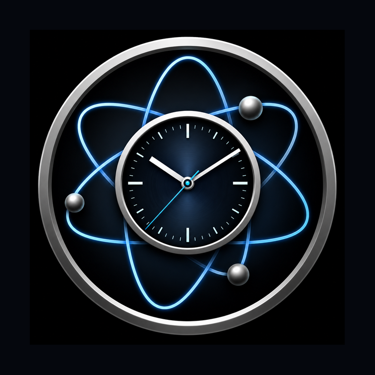
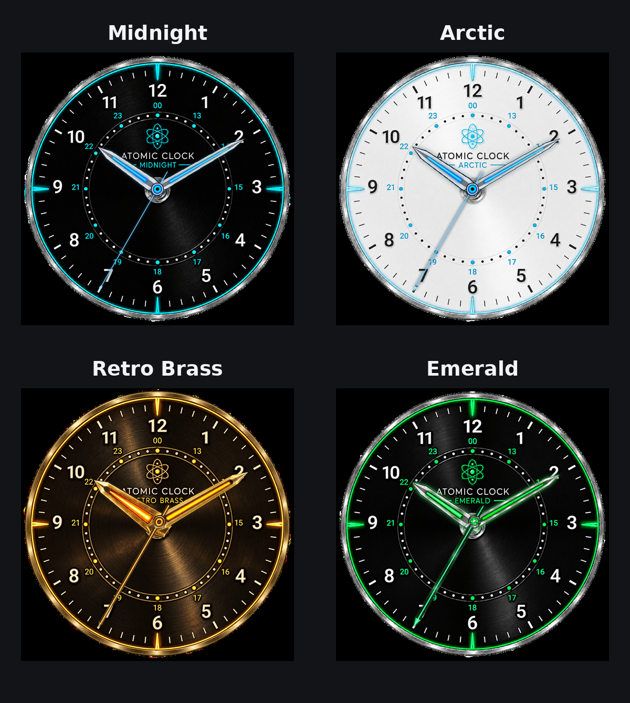

<div align="center">



# 🕰️ Atomic Clock

### Precise time over NTP · live local weather · premium home-screen widgets


[**⬇️ Latest Release**](https://github.com/MikereDD/AtomicClock/releases/latest) &nbsp;·&nbsp; [**📜 Changelog**](CHANGELOG.md) &nbsp;·&nbsp; [**🗺️ Roadmap**](ROADMAP.md)

</div>

---

Atomic Clock is an Android precision clock that syncs against internet time servers over **SNTP/NTP**, displays live local weather, and provides both practical and showcase-grade home-screen widgets.

## ⏱️ What makes it accurate

- 🛰️ **SNTP client (RFC 4330)** — computes clock offset and round-trip delay from the four NTP timestamps, modelled on AOSP's `SntpClient`.
- ⚓ **Monotonic anchoring** — resolved time is pinned to `SystemClock.elapsedRealtime()`, so it stays useful even if the device wall clock changes.
- 🎯 **Best-of-N sampling** — foreground sync keeps the lowest-latency response and falls back across multiple public NTP providers.
- 🔋 **Battery-conscious background sync** — cached NTP/weather/location data is reused when still fresh and background work respects network and battery constraints.

## 🌦️ Weather

- 🌡️ Current **temperature, conditions, feels-like, humidity, wind** (speed + direction), **dew point**, and **city**.
- 🔑 Powered by [Open-Meteo](https://open-meteo.com) — free and keyless.
- 📍 Coarse location via the platform `LocationManager` (no Play Services). Weather is optional; the clock works without location access.
- 🧭 Background location is optional and only needed when the widget should follow location changes while the app is closed.

## 🧩 Home-screen widgets

Atomic Clock includes the preserved **Classic** widget family and the precision **Dial** widget family.

### Precision Dial themes

The Dial uses one verified mechanical geometry across every visual family, so switching themes changes the instrument's appearance without changing its timing layout.



| Midnight | Arctic |
| --- | --- |
| Dark precision-instrument face with cyan accents and matching live hands. | Bright silver/white face with icy-blue accents and the proven Midnight hand geometry. |

| Retro Brass | Emerald |
| --- | --- |
| Aged bronze/brass face with warm amber accents and matching brass hands. | Black/chrome face with vivid emerald accents and matching green/chrome hands. |

The Dial supports **Midnight · Arctic · Retro Brass · Emerald**, responsive compact/normal/large placements, live hour/minute/second hands, NTP drift, date, weather, humidity, and **Solid · Translucent · Clear** widget backgrounds.

## ⚙️ Settings

- 🎨 Dial theme: **Midnight · Arctic · Retro Brass · Emerald**.
- 🌡️ Independent **°C / °F** and **km/h / mph** toggles, defaulting by locale.
- 🕓 24-hour / 12-hour and milliseconds on/off.
- 🌐 Time source: **Google · Cloudflare · NTP Pool · Apple · NIST**.
- 🖼️ Widget background: **Solid · Translucent · Clear**.
- ℹ️ About dialog with version, credits, and the public GitHub repository.

## 🔄 Secure updates

Atomic Clock includes a Typezer∅-standard in-app updater with separate **Stable**
and **Development** channels. Update payloads are accepted only after approved
origin, manifest/protocol, SHA-256, detached RSA signature, package/version, and
pinned Android signing-certificate checks pass. Android's system installer always
retains final user confirmation.
## 📲 Install
Open the [**latest GitHub Release**](https://github.com/MikereDD/AtomicClock/releases/latest), download the signed APK, and install it on your Android device.

> **Permissions:** `INTERNET`; `ACCESS_COARSE_LOCATION` (optional — weather); `ACCESS_BACKGROUND_LOCATION` (optional — following location changes while the app is closed); `RECEIVE_BOOT_COMPLETED` (restores scheduled widget maintenance after reboot); `REQUEST_INSTALL_PACKAGES` (only when you choose to install a verified direct-update APK).

## 🛠️ Build

Debug/development build:

```sh
./gradlew assembleDebug
```

Windows release build using the repository's verification pipeline:

```powershell
.\scripts\Build-Release.ps1
```

Release signing credentials are supplied outside Git. See [**Android release signing**](docs/releases/SIGNING.md) and the full [**release procedure**](docs/releases/RELEASING.md).

`minSdk` 26 · `targetSdk` / `compileSdk` 35 · Kotlin 2.1 · Jetpack Compose (Material 3)

## 📂 Project layout

```text
app/src/main/java/com/typezero/atomicclock/
├── MainActivity.kt
├── ClockViewModel.kt
├── ntp/        SNTP client and server definitions
├── data/       Time sync and persisted settings
├── weather/    Open-Meteo, location, and weather data
├── ui/         Main application UI, formatting, theme, components
├── update/     Secure updater, trust anchors, manifest/signature/package verification
└── widget/     Classic + precision Dial widgets and renderers

scripts/
├── Build-Release.ps1
├── Create-Signing-Key.ps1
├── Generate-Checksums.ps1
├── Generate-Manifest.ps1
└── Verify-Release.ps1

docs/releases/
├── SIGNING.md
├── RELEASING.md
└── v0.6.0.md
```

## 🔐 Release integrity

Public releases are tied to Git tags and distributed as signed Android APKs. The release bundle includes a SHA-256 checksum file, signer verification output, and a machine-readable release manifest. Signing keys and passwords never belong in the repository.

## 📜 Changelog

See the [**full changelog**](CHANGELOG.md) for version history and the [**roadmap**](ROADMAP.md) for the path to v1.0.

## ⚖️ License

Atomic Clock is licensed under the **Apache License 2.0**. See [LICENSE](LICENSE) for the full license text.

<div align="center"><sub>Built by <b>Typezer∅</b></sub></div>
